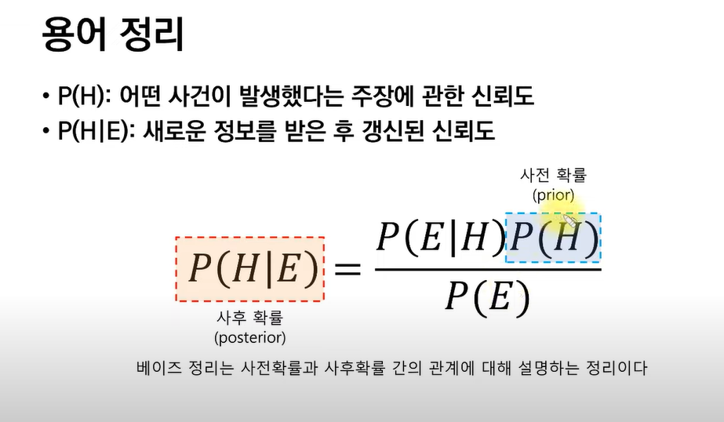

Conditional vs Marginal Independence

베이즈 정리의 의미 : 

공식 : P(H|E) = P(E|H)P(H)/P(E)

여기서 핵심적으로 봐야하는 것은 P(H|E)와 P(H)이다.
P(H|E)를 사후확률, P(H)를 사전확률이라고 한다.
베이즈 정리는 사전확률과 사후확률의 관계에 대해 설명하고 있다.

베이즈 정리를 이해하기 어려운 이유?
- '확률'에 대한 관점의 변화가 필요하다.
우리가 생각하는 확률의 전통적인 관점은 빈도주의이다.
P(T)=1/2라면 동전을 백 번 던졌을 때 앞면이 50번 나온다.가 빈도주의적인 관점이다.
베이지안 주의는 '확률'을 '주장에 대한 신뢰도'로 해석하는 관점이다.
동전의 앞면이 나왔다는 주장의 신뢰도가 50%다.

위 공식에서 E와 H가 구체적으로 의미하는 것은?
H : Hypothesis. 가설 혹은 '어떤 사건이 발생했다는 주장'
E : Evidence. '새로운 정보'

P(H): 어떤 사건이 발생했다는 주장에 관한 신뢰도
P(H|E): 새로운 정보를 받은 후 갱신된 신뢰도

 출처: https://www.youtube.com/watch?v=euH9C61ywEM&t=50s

용어 정리.
베이즈 정리의 의의 : 확률론 패러다임의 전환 : 연역적 추론에서 귀납적 추론으로 

